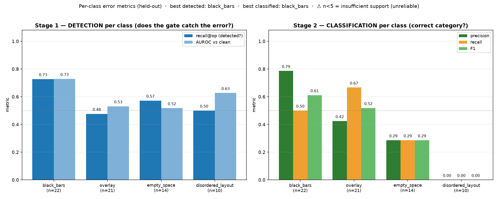

# Experiment results — UI layout-error detector (siamese head · frozen DINOv2)

> **Config:** `default.yaml` · **Dataset:** `data/processed_v3` (single source of truth, flat + labels.csv) ·
> **Held-out:** 108 images (41 clean + 67 errors), test **locked** and evaluated **once**.
> Selection/calibration **on validation only** (anti-leakage protocol).

## ⚠️ How to read these numbers (READ BEFORE COMPARING)

This dataset has a **resolution confound**: **every** clean screen is 2076×2152 (a single device).
The trivial rule *"resolution ≠ 2076×2152 ⇒ error"* alone gives **AUROC 1.000** — without
looking at the layout. **So the GLOBAL metric is ~98% confound.** For a **fair** comparison with other
models:
- **DO NOT** lead with global accuracy/AUROC (a naive model "wins" by exploiting the device).
- **LEAD** with the **confound-free** metrics (§2) and check whether the competitor beats the
  **confound baseline** (§3).

## 1. Standard metrics (Stage 1 — "is there an error?" gate) — balanced operating point

> Production decision (prototype+aux fusion, **calibrated on the confound-free validation set**).

| Metric | Value | 95% CI |
|---|---|---|
| **Accuracy** | **0.583** | [0.49–0.67] |
| **Precision** | **0.696** | [0.46–0.95] |
| **Recall (sensitivity)** | **0.582** | — |
| **F1-score** | **0.634** | [0.49–0.76] |
| **Specificity** | **0.585** | [0.25–0.74] |
| **Balanced accuracy** | **0.584** | — |
| **MCC** | **0.163** | — |
| **AUROC** (fusion / prototype) | **0.596 / 0.607** | — |
| **AP (PR-AUC)** | **0.708** | — |
| Brier / ECE (calibration) | 0.265 / 0.153 | — |

Confusion matrix (gate): **TP=39 · TN=24 · FP=17 · FN=28**
(`artifacts/reports/confusion_matrix.png`).

> **For the comparison table**, prefer **AUROC/AP** (threshold-free) and the **prototype** (cleaner
> signal, AUROC 0.607). The fusion AUROC (0.596) is lower **on purpose**: it was
> calibrated **not** to exploit the resolution confound.

## 2. CONFOUND-FREE metrics (the honest ones — lead with these)

| Evaluation | Model (prototype) | Confound baseline | Verdict |
|---|---|---|---|
| **Confound-free synthetic** (errors injected into clean screens, same resolution) | **AUROC 0.721** · AP 0.903 | — | ✅ real signal |
| **Controlled subset** (form-factor/orientation fixed) | **AUROC 0.602** [0.44–0.74] | 0.321 | ✅ beats it |
| **Falsifiability** (predicts error vs predicts resolution) | error 0.596 | resolution 0.596 | ⚠️ tracks resolution |

## 3. Confound baselines (the "cheating ceiling" — what to compare against)

| Classifier | AUROC |
|---|---|
| Trivial resolution-only rule | 1.000 |
| Gray-padding fraction only | 1.000 |
| LogReg on raw DINOv2 | 0.716 |
| **Model (prototype)** | **0.607** |
| One-class kNN (DINOv2) | 0.644 |

## 4. Stage 2 — error category (only when Stage 1 = error)

| Taxonomy | macro-F1 | 95% CI | note |
|---|---|---|---|
| **Coarse (2 super-classes)** ⭐ | **0.641** | [0.52–0.75] | primary (statistical power) |
| Coarse, gate-conditioned (production) | 0.643 | — | only errors flagged by Stage 1 |
| Fine (4 classes) | 0.354 | — | secondary/exploratory (structural ceiling) |

> ⚠️ The coarse macro-F1 is higher because it is a **2**-class task (aggregation of the 4 fine
> classes), **not** because the model got better; the lower CI bound is near chance (0.25).
> Always report **with the CI**.

## 5. PER-CLASS metrics (per error category — coordinator request)

Two distinct questions → two metrics (do not conflate):
- **Detection (Stage 1):** of all errors in this category, how many does the "is there an error?" gate catch.
- **Classification (Stage 2):** once it is an error, does the model assign the correct category.

| Category | n (test) | **Detection** recall@op | **Detection** AUROC vs clean [CI95] | **Classif.** precision | **Classif.** recall | **Classif.** F1 |
|---|---|---|---|---|---|---|
| `black_bars` | 22 | 0.727 | 0.728 [0.59–0.88] | 0.786 | 0.500 | 0.611 |
| `disordered_layout` | 10 | 0.500 | 0.627 [0.46–0.82] | 0.000 | 0.000 | 0.000 |
| `empty_space` | 14 | 0.571 | 0.517 [0.33–0.72] | 0.286 | 0.286 | 0.286 |
| `overlay` | 21 | 0.476 | 0.531 [0.37–0.69] | 0.424 | 0.667 | 0.519 |

> **How to read:** *recall@op* = fraction of that category's errors flagged as ERROR at the operating
> threshold. *AUROC vs clean* = category-vs-clean separability (⚠️ **confounded** — each category has its
> own resolution profile; indicative only). *precision/recall/F1* = quality of the **category assignment**
> (Stage 2). **There is no per-class precision for the gate** (a false positive is a clean screen, not
> attributable to a category). ⚠️ Classes with **small n** (e.g. `disordered_layout`) have unstable
> metrics — always read with the **support**.

**Ranking (support ≥ 5 only):** best **detected** = **black_bars** · worst
detected = **empty_space** · best **classified** = **black_bars**.

📊 **Slide-ready charts** (per-class bars, detection × classification; n<5 dimmed/⚠):
- 🇬🇧 EN: `per_class_metrics_en.png` · `per_class_metrics_en.pdf` (vector — for paper/projector)
- 🇧🇷 PT: `metricas_por_classe.png` · `metricas_por_classe.pdf` (vector)

## 6. VERDICT — does the model work on this dataset?

- ✅ REAL CONTENT SIGNAL: on the CONTROLLED subset (form-factor/orientation fixed) the model (prototype AUROC 0.602) BEATS the confound baseline (0.321); and on the CONFOUND-FREE synthetic it reaches AUROC 0.721 (AP 0.903). The model detects the ERROR, not just the device.
- ⚠️ CONFOUND NOT BEATEN globally: the score predicts ERROR (0.596) about as well as RESOLUTION (0.596) (gap 0.000). The confound is ATTENUATED, not eliminated — beating it needs more diverse CLEAN screens (data).
- ℹ️ The GLOBAL metric is confounded: the trivial resolution rule alone gives AUROC 1.000 — so the model's global accuracy must NOT be compared naively with models that exploit the confound. Lead with confound-free AUROC.

---
*Generated by `scripts/run_experiment.py`. Flat metrics JSON:
`artifacts/reports/EXPERIMENT_RESULTS.json`. Methodology: `docs/DESIGN.md`,
results: `docs/RELATORIO_FINAL_PROCESSED_V3.md`.*
