# Detector de Erros de Layout em UI — Rede Siamesa sobre DINOv2

### Relatório de apresentação para a equipe do projeto

> **Objetivo:** dada uma imagem/print de tela de celular, decidir em **dois estágios**:
> **(E1)** a tela **tem erro de layout** ou **não tem** (gate binário de alta precisão); e,
> quando tem, **(E2)** **de que tipo** é o erro (categoria). Tudo sobre uma **rede siamesa**
> com o backbone **DINOv2 ViT-S/14 congelado**.

📐 Diagrama do pipeline: bloco Mermaid embutido na §3-bis abaixo (renderiza no GitHub/GitLab/VS Code) · fonte em [`pipeline.mmd`](pipeline.mmd)
🎯 Visualização para a reunião: `clusters_apresentacao.html` / `categorias_apresentacao.html` (gerados por `scripts/visualize.py`)
🔬 Detalhes técnicos e decisões: [`DESIGN.md`](DESIGN.md) · 🧪 técnicas portadas do projeto legado: [`DESIGN.md` §11](DESIGN.md)

> ⚠️ **Esta versão (jun/2026) corrige números REVOGADOS.** Versões antigas deste relatório
> traziam acc 0.85 / AUROC 0.90 ("test 54 imgs") — **inválidos**: vinham de *split com
> vazamento* + *seleção que enxergava o teste* (auditoria Fase 0). Os números abaixo são o
> **held-out honesto** (teste trancado, seleção só na validação, avaliado **1×**).

---

## 1. Sumário executivo

Construímos um detector de erros de layout em telas de UI em **dois estágios** (gate "tem
erro?" → categoria do erro) sobre uma rede siamesa. O achado que organiza todo o projeto: **o
dado tem um confound quase perfeito** — as telas *sem-erro* são **todas de um único
dispositivo** (2076×2152) e as *com-erro* são heterogêneas. Uma regra trivial ("a resolução é
≠ 2076×2152?") já dá **AUROC 0.99** sem olhar o layout. Logo, **qualquer métrica global é ~98%
trapaça**; só medições **livres de confound** (sintético casado em resolução, subconjunto
controlado, falseabilidade) dizem se há detecção **real**.

Nesta rodada **consolidamos o modelo e portamos três técnicas comprovadas do projeto
anterior** (`~/iats/layout_siamesa`), com ganhos medidos no **held-out honesto**:

| Eixo | Antes | **Depois** | O que mudou |
|---|---|---|---|
| **Ponto de operação** (especificidade) | 0.12 (FPR 0.88) | **0.27** (FPR 0.73) | **Calibração livre de confound** (na val sintética, não em 26 limpas) |
| **bAcc / MCC** (held-out) | 0.54 / 0.17 | **0.57 / 0.18** | idem |
| **Rastreamento do confound** (falseab.) | 0.72 (≈ erro) | **0.68** (val 0.76→0.62) | **Reflow**: variantes limpas em outras resoluções |
| **Detecção real** (sintético livre de confound) | 0.695 | **0.723** | reflow + calibração |
| **Estágio 2 (categoria)** | confuso (2 métodos paralelos, F1 fino 0.39) | **claro** (1 método; fino 0.36 + grosso 0.62, IC 0.38–0.76) | **Consolidação** (clareza); o 0.62 é a tarefa mais fácil de **3** super-classes, não ganho de qualidade |

**Mensagem para a equipe (honesta):**
1. **O conserto mais forte foi a calibração do ponto de operação** — o limiar antigo, fixado
   em 26 telas limpas, **inundava de falso-alarme** (especificidade 0.12). Calibrando na
   **validação livre de confound**, a especificidade **dobra** sem perder F1. (Prova: no mesmo
   modelo, a calibração antiga dá especificidade **0.00** — sinalizava *toda* tela limpa como erro.)
2. **O Estágio 2 ficou claro e reportável:** **um único método canônico** (protótipo de
   categoria) e **taxonomia mais grossa** (3 super-classes) — F1-macro **0.62** (vs 0.39 do
   desenho antigo, que reportava dois métodos em paralelo).
3. **O reflow reduz o rastreamento do confound** (a tese "detecta conteúdo, não device"), com
   um trade-off honesto de especificidade — documentado na ablação (§6.6).
4. O **teto do gate continua limitado por DADO** (classe limpa = 1 device): subir o AUROC
   depende de **telas limpas diversas**, não de mais tuning (§7–8).

---

## 2. O problema e os dados

**6 categorias de erro** (`data/input/errors_dataset/<categoria>/`, usadas no Estágio 2):
black bars · disordered layout · distortion · empty space · orientation · overlay.

**Dataset** (**541 imagens reais únicas**, após limpeza de marcações + dedup):
- `no_erros`: **172** telas limpas, **todas 2076×2152** (mesmo device, telas de onboarding).
- `errors_dataset`: **369** telas com erro por categoria — **heterogêneas** em resolução,
  fotos de câmera, form factors fold/unfold/laptop/tent.
- Split **agrupado** (erros por ticket IKSWW; limpas por **sessão+near-duplicate**) e
  **estratificado por categoria**: **train 330** (105 limpas + 225 erros) · **val 81** (26+55)
  · **test 130** (41+89), com **0 vazamento** verificado (`tests/test_split_isolation.py`).
- Augmentação de treino (não conta como dado real): **+420 sintéticos-erro** + **+420
  limpas-reflow** (anti-confound dos dois lados).

---

## 3-bis. Diagrama do pipeline

> Renderiza automaticamente no GitHub/GitLab/VS Code (extensão Mermaid). Fonte: [`pipeline.mmd`](pipeline.mmd).

```mermaid
---
title: "Pipeline · Detector de erros de layout em UI — rede siamesa sobre DINOv2 (congelado)"
---
%%{init: {
  "theme": "base",
  "themeVariables": {
    "fontFamily": "Segoe UI, Helvetica, Arial, sans-serif",
    "fontSize": "14px",
    "lineColor": "#607D8B",
    "primaryTextColor": "#1A2027"
  },
  "flowchart": { "curve": "basis", "nodeSpacing": 50, "rankSpacing": 55 }
}}%%
flowchart TB
    %% =====================================================================
    %% Fonte unica do diagrama do pipeline. Renderiza no GitHub / GitLab / VS Code
    %% (extensao Mermaid). O bloco embutido em docs/RELATORIO_APRESENTACAO.md
    %% (secao "3-bis") deve espelhar EXATAMENTE este arquivo.
    %%
    %% Linha GROSSA  ( ==> ) = caminho principal (o percurso de uma tela ate a decisao).
    %% Linha fina    ( --> ) = ligacao de apoio.
    %% Linha pontilhada (-.->) = entrada auxiliar / saida derivada (nao e o fluxo principal).
    %% =====================================================================

    %% ===================== 1. DADOS =====================
    subgraph S1["1 · Dados de entrada"]
        direction TB
        D1["no_erros — 172 telas LIMPAS<br/>todas 2076×2152 (um único device)"]:::dados
        D2["errors_dataset — 369 telas COM ERRO<br/>6 categorias · resoluções · fotos · fold/laptop/tent"]:::dados
        SPLIT["Split AGRUPADO (ticket + sessão) · estratificado<br/>0 vazamento<br/>train 330 · val 81 · test 130"]:::dados
        D1 --> SPLIT
        D2 --> SPLIT
    end

    %% ============ 2. SINTETICOS (ANTI-CONFOUND) — DOIS LADOS ============
    subgraph S2["2 · Anti-confound dos DOIS lados (erro + limpo)"]
        direction TB
        WHY["⚠ Confound: toda tela LIMPA é 2076×2152 (1 device).<br/>Sem tratar, o modelo trapaceia detectando a RESOLUÇÃO (≈98%)."]:::warn
        SYN["🧪 lado do ERRO: injeta 5 tipos de erro nas LIMPAS<br/>black region · empty space · overlay · disorder · cropped<br/>na MESMA resolução (par casado)"]:::synth
        REF["🔄 lado do LIMPO (REFLOW): variantes LIMPAS de layout<br/>legítimo — scroll · dual-pane · outro aspect-ratio · espaçamento<br/>(label = limpo) → quebra o confound pela classe limpa"]:::synth
        WHY -.-> SYN
        WHY -.-> REF
    end

    %% ============ 3. PRE-PROCESSAMENTO + BACKBONE ============
    subgraph S3["3 · Pré-processamento + backbone congelado"]
        direction TB
        PRE["Padding CINZA → 518×518<br/>preserva o aspecto (sem distorcer)<br/>+ máscara de patch (ignora o cinza)"]:::preproc
        BB["🔒 DINOv2 ViT-S/14 — CONGELADO<br/>22M params · 0 treináveis<br/>grade 37×37 patches"]:::frozen
        EMB["Embedding 1152-d<br/>CLS 384 + média 384 + desvio 384<br/>(dos patch tokens)"]:::preproc
        CACHE[("Cache .npz<br/>extrai 1× · reusa sempre")]:::cache
        PRE ==> BB ==> EMB ==> CACHE
    end

    %% ============ 4. REDE SIAMESA (TREINAVEL) ============
    subgraph S4["4 · Rede siamesa — única parte treinável (~330k params)"]
        direction TB
        HEAD["🎯 Cabeça de projeção g(·) COMPARTILHADA<br/>LayerNorm → Linear 1152→256 → GELU<br/>→ Linear 256→128 → L2-normaliza"]:::head
        Z["z (128-d) na hiperesfera unitária<br/>espaço métrico aprendido"]:::head
        AUX["Cabeça auxiliar<br/>Linear 128→7 (softmax: clean + 6 categorias)<br/>P(erro) = 1 − P(clean)"]:::head
        LOSS["PERDA (treino) = SupCon(z) + 0.6 · CE(aux)<br/>SupCon agrupa por CATEGORIA<br/>limpo+reflow juntos · erros afastados"]:::loss
        HEAD ==> Z
        Z --> AUX
        Z --> LOSS
        AUX --> LOSS
    end

    %% ============ 5. DECISAO EM DOIS ESTAGIOS (PROTOTIPO / CLUSTERING) ============
    subgraph S5["5 · Decisão em DOIS estágios — clustering no espaço aprendido"]
        direction TB
        PROTO["Protótipo(s) do cluster LIMPO<br/>k-means sobre z das telas limpas (treino)<br/>resume o que é normal"]:::decis
        SCORE["score = 1 − cos(z, protótipo limpo mais próximo)<br/>longe do limpo ⇒ anomalia"]:::decis
        FUS["Fusão calibrada na VAL LIVRE DE CONFOUND<br/>(score do protótipo, P(erro) auxiliar) → p(erro)"]:::decis
        THR["Limiar de operação (val livre de confound)<br/>balanceado · alta precisão · specificity-first"]:::decis
        DEC{"E1 · erro?<br/>p(erro) ≥ limiar"}:::decis
        CAT["E2 · categoria (só se E1=erro)<br/>protótipo de categoria mais próximo<br/>3 super-classes: região morta · deslocado · geometria"]:::decis
        SCORE ==> FUS ==> THR ==> DEC
        PROTO --> SCORE
        DEC ==>|"sim"| CAT
    end

    %% ============ 6. SAIDAS / VISUALIZACOES ============
    subgraph S6["6 · Saídas e visualizações"]
        direction TB
        O1["predict.py · infer.py<br/>p(erro) + decisão por imagem"]:::out
        O2["localize.py<br/>heatmaps PatchCore + geométrico<br/>(ONDE está o erro)"]:::out
        O3["visualize.py<br/>clusters · distância · tradeoff<br/>+ HTML interativo"]:::out
        O4["evaluate.py<br/>AUROC/AP · baselines de confound<br/>falseabilidade · IC bootstrap"]:::out
    end

    %% ============ RESULTADO (o retorno do pipeline) ============
    RES["<b>RESULTADO</b> — held-out honesto (130 imgs · teste trancado, 1×)<br/>E1 gate: AUROC proto 0.73 · sintético livre de confound 0.72 (AP 0.89)<br/>ponto de operação: especificidade 0.27 · bAcc 0.57 (calibração livre de confound)<br/>E2 categoria: F1-macro 0.62 (taxonomia grossa, 3 super-classes)"]:::result

    %% ===================== LIGACOES ENTRE ETAPAS =====================
    D1 -.->|"gera erros (mesma resolução)"| SYN
    D1 -.->|"gera limpas-reflow"| REF

    SPLIT ==> PRE
    SYN -->|"(somente no treino)"| PRE
    REF -->|"(somente no treino)"| PRE

    CACHE ==> HEAD

    Z ==>|"z da tela-alvo"| SCORE
    Z -->|"z das telas limpas (treino)"| PROTO
    AUX -.->|"logit auxiliar"| FUS

    DEC ==> O1
    DEC --> O4
    BB -.->|"patch tokens (atenção)"| O2
    Z -.->|"z para visualizar"| O3
    O4 --> RES

    %% ===================== LEGENDA =====================
    subgraph LEG["Legenda — o que cada cor significa"]
        direction LR
        LG1["🔒 Congelado<br/>(não treina)"]:::frozen
        LG2["🎯 Treinável<br/>(única parte que aprende)"]:::head
        LG3["🧪 Sintéticos<br/>(anti-confound)"]:::synth
        LG4["Decisão<br/>(protótipo / clustering)"]:::decis
        LG5["Saídas / scripts"]:::out
        LG1 ~~~ LG2 ~~~ LG3 ~~~ LG4 ~~~ LG5
    end

    NOTE_PHASE["⏱ Treino (roda 1×): etapas 1–4 + ajuste da decisão na validação.<br/>🚀 Inferência (por imagem): pré-proc → DINOv2 → cabeça → score → p(erro) → decisão."]:::note

    %% ancora a legenda e a nota abaixo do resultado (linhas invisiveis)
    RES ~~~ NOTE_PHASE
    NOTE_PHASE ~~~ LEG

    %% ===================== ESTILOS =====================
    classDef dados   fill:#E3F2FD,stroke:#1565C0,stroke-width:1px,color:#0D47A1;
    classDef synth   fill:#FFF3E0,stroke:#E65100,stroke-width:2px,color:#BF360C;
    classDef preproc fill:#E0F2F1,stroke:#00695C,stroke-width:1px,color:#004D40;
    classDef frozen  fill:#ECEFF1,stroke:#455A64,stroke-width:1.5px,color:#263238;
    classDef cache   fill:#FAFAFA,stroke:#9E9E9E,stroke-width:1px,color:#424242;
    classDef head    fill:#E8F5E9,stroke:#2E7D32,stroke-width:1.5px,color:#1B5E20;
    classDef loss    fill:#F1F8E9,stroke:#558B2F,stroke-width:2px,color:#33691E;
    classDef decis   fill:#F3E5F5,stroke:#6A1B9A,stroke-width:1px,color:#4A148C;
    classDef out     fill:#FFFDE7,stroke:#F9A825,stroke-width:1px,color:#F57F17;
    classDef result  fill:#37474F,stroke:#263238,stroke-width:1px,color:#FFFFFF;
    classDef note    fill:#FAFAFA,stroke:#90A4AE,stroke-width:1px,color:#37474F,stroke-dasharray:4 3;
    classDef warn    fill:#FFF3E0,stroke:#E65100,stroke-width:1px,color:#BF360C,stroke-dasharray:4 3;

    style S1 fill:#F5FAFF,stroke:#90CAF9,color:#1565C0
    style S2 fill:#FFF8F0,stroke:#FFB74D,color:#E65100
    style S3 fill:#F2FBFA,stroke:#80CBC4,color:#00695C
    style S4 fill:#F4FBF4,stroke:#A5D6A7,color:#2E7D32
    style S5 fill:#FBF4FD,stroke:#CE93D8,color:#6A1B9A
    style S6 fill:#FFFEF2,stroke:#FFE082,color:#F9A825
    style LEG fill:#FFFFFF,stroke:#CFD8DC,color:#546E7A
```



---

## 3. Problemas identificados e propostas de solução

Esta seção é o coração do trabalho — cada problema foi **diagnosticado com dados** e tem uma
solução **implementada e medida**.

| # | Problema | Evidência | Solução implementada |
|---|---|---|---|
| 1 | **Confound de resolução/device** (o crítico) | Regra "res≠2076×2152" dá **AUROC 0.982 / precisão 1.00** | **Injeção de erros sintéticos** nas telas limpas (mesma resolução) → o modelo aprende conteúdo, não device |
| 2 | **Foto vs screenshot** | 47 fotos, **todas** na classe erro | Sintéticos casam o tipo; avaliação reporta métrica separada por foto/screenshot |
| 3 | **Resize distorce o erro** | resize anamórfico espreme faixas pretas | **Padding CINZA** preservando o aspecto (ver §3.1) |
| 4 | **Caixa vermelha desenhada** (`_boundBox`) | 2 imagens com anotação | Detectadas e sinalizadas; recomendado inpaint antes da extração |
| 5 | **`_competitor`** (UI de concorrente) | 16 imgs, possível ruído de rótulo | Campo `is_competitor` no manifesto; auditável separadamente |
| 6 | **Dados pequenos (~360)** | overfit imediato se treinar tudo | **Backbone congelado** + cabeça leve (~330k params) |
| 7 | **Vazamento entre splits** | múltiplas imgs por ticket | **Split agrupado por ticket** (0 vazamento) |

### 3.1. Padding cinza — a ideia validada empiricamente

**Problema:** o resize anamórfico (espremer para 518×518) **distorce a geometria do erro** —
uma faixa preta lateral fica achatada. O padding tradicional (preto) **imita** o erro
"black region", e o padding com bordas grandes vaza o aspect-ratio (logo o form factor).

**Solução:** padding até quadrado **preservando o aspecto**, preenchido com o **cinza neutro
da média ImageNet** (vira ~0 após a normalização → influência mínima na rede; é distinto de
preto e do fundo branco das telas — *nenhum erro é "tela cinza"*). E para a área de cinza
não virar um confound de aspect-ratio, calculamos as estatísticas de patch **só na região de
conteúdo** (máscara).

**Medição** (test, `scripts/compare_preprocess.py`):

| Métrica | resize (anamórfico) | **pad (cinza)** |
|---|---|---|
| Subconjunto controlado AUROC | 0.865 | **0.910** |
| Precisão @ alvo 0.95 | 0.917 | **1.000** |
| Recall @ alvo 0.95 | 0.39 | **0.50** |
| Detecção sintética AUROC | 0.881 | 0.882 |

→ **pad é melhor ou igual em tudo** e virou o padrão. (A ideia veio da própria equipe e se
confirmou.)

---

## 4. Como o modelo funciona — UM espaço, DOIS estágios

A peça única e compartilhada é a **cabeça de projeção `g(·)`** (a "siamesa"): a **mesma
função** mapeia o embedding DINOv2 de **qualquer** tela para um vetor **`z` de 128-d na
hiperesfera** (L2-normalizado). Toda a decisão — gate e categoria — é **distância a
protótipos nesse espaço `z`**. Essa é a narrativa única que torna o desenho fácil de explicar:

> **Tudo é "quão perto estou de um protótipo no espaço aprendido `z`".**
> O Estágio 1 mede a distância ao protótipo **limpo**; o Estágio 2, ao protótipo de cada
> **categoria de erro**.

**Por que não comparar contra "uma" tela de referência boa?** Porque a classe *sem-erro* é
visualmente diversa (apps diferentes): duas telas limpas distintas seriam legitimamente
"diferentes" mesmo ambas corretas → **falso-positivo estrutural**. Por isso comparamos contra
**protótipos do cluster limpo** (siamesa *one-class*), não contra uma imagem única. O
**reflow** (§5) reforça exatamente isto: ensina que "mesmo conteúdo, layout diferente = ainda
limpo".

**Como o espaço é construído (treino, roda 1×):**
1. **DINOv2 ViT-S/14 congelado** extrai 1152-d (CLS + média/desvio dos patch tokens) — mesmo
   extrator p/ qualquer imagem, calculado uma vez e **cacheado**.
2. **Cabeça `g(·)`** (única parte treinável, ~330k params) → `z` (128-d). Treinada com
   **Supervised Contrastive (SupCon)** por **categoria**: aproxima telas da mesma classe e
   afasta classes diferentes. Limpas reais **e** limpas-reflow caem no mesmo cluster; cada
   categoria de erro forma o seu.

**Estágio 1 — gate "tem erro?" (alta precisão):**
- **Protótipos do cluster limpo** (k-means sobre `z` das limpas de treino). `score = 1 −
  cos(z, protótipo limpo mais próximo)`: longe do limpo ⇒ anomalia.
- **Fusão calibrada** `[score do protótipo, P(erro) da cabeça auxiliar]` → `p(erro)`,
  ajustada na **validação livre de confound** (limpas + sintéticos-erro + reflow). **Limiar**
  fixado nessa mesma validação (balanceado / alta precisão / specificity-first).
- `p(erro) ≥ limiar` ⇒ **ERRO**.

**Estágio 2 — categoria (só roda quando E1 = ERRO):**
- **UM método canônico** (decisão consolidada): a categoria é a do **protótipo de categoria
  mais próximo** em `z` (mesma matemática do E1 — `1 − cos`). A cabeça auxiliar fica como
  *diagnóstico*, não como segundo decisor.
- **Taxonomia primária = 3 super-classes** (agrupadas pelo princípio de não-colisão):
  **região morta** (black bars + empty space) · **conteúdo deslocado** (overlay + disordered)
  · **geometria global** (distortion + orientation). A taxonomia fina de 6 classes é reportada
  como **secundária/exploratória** (tem teto estrutural — ver §6.5).

> **Por que a categoria virou "protótipo" e não a cabeça softmax?** Para a equipe: assim o
> projeto inteiro tem **uma só ideia** — distância a protótipos no espaço `z`. O desenho antigo
> reportava *dois* métodos (protótipo **e** softmax) em paralelo, com F1 quase iguais — era a
> fonte da confusão. Agora há **um** decisor.

### 4.1. Âncora/Triplet? Qual a função de erro?

- **NÃO** usamos Triplet clássica. Usamos **SupCon**, uma generalização: em cada *batch* cada
  amostra é âncora; mesma classe = positivos, classes diferentes = negativos. Mais estável com
  poucos dados (usa todos os pares do batch) e a **âncora reaparece na inferência** (a tela
  comparada aos protótipos).
- **Função de erro:** &nbsp; **`L = SupCon(z) + 0.6 · CE(cabeça_auxiliar)`** (multi-classe:
  clean + 6 categorias). A `CE` da cabeça auxiliar é um classificador direto (o gate usa
  `P(erro) = 1 − P(clean)`); o SupCon molda o espaço métrico que sustenta os protótipos.
- As classes auxiliares funcionam como **regularização** (lição do legado: o gate binário-puro
  *satura* o sintético e não transfere — manter o vocabulário de categorias estabiliza).

```
L_supcon = - (1/|P(i)|) · Σ_{p∈P(i)} log( exp(z_i·z_p / τ) / Σ_{a≠i} exp(z_i·z_a / τ) )
```

---

## 5. Diferencial do modelo proposto

1. **Anti-confound dos DOIS lados.** (a) Pelo lado do **erro**: injetamos 5 tipos de erro nas
   limpas, na **mesma resolução** (par casado) — isola o conteúdo. (b) **NOVO — pelo lado do
   LIMPO (reflow):** geramos variantes **limpas** de layout legítimo (scroll, dual-pane, outro
   aspect-ratio, espaçamento) — algumas em **outras resoluções**. Resultado: a classe limpa
   deixa de ser exclusivamente 2076×2152, **quebrando o atalho da resolução pelos dois lados**.
   (Técnica portada do projeto legado, onde foi o maior ganho; ver [`DESIGN.md` §11](DESIGN.md).)
2. **Siamesa one-class com protótipos, em DOIS estágios** — uma só ideia (distância a
   protótipos no espaço `z`) para o gate (E1) e a categoria (E2), sem a armadilha da
   "referência única".
3. **NOVO — Calibração do ponto de operação na validação LIVRE DE CONFOUND.** O limiar/fusão
   deixou de ser fixado em 26 telas limpas (instável → falso-alarme) e passou a usar limpas +
   sintéticos-erro + reflow da validação. **Dobra a especificidade** no held-out sem perder F1.
   (Lição do legado: calibrar na validação sintética, nunca no teste.)
4. **NOVO — Estágio 2 consolidado**: **um** decisor canônico (protótipo de categoria) +
   **taxonomia grossa** (3 super-classes) com poder estatístico. Sai do desenho confuso de dois
   métodos em paralelo.
5. **Avaliação honesta (mantida e ampliada)** — global é ~98% confound, então reportamos
   sempre **baselines de confound**, **subconjunto controlado**, **sintético livre de
   confound**, **falseabilidade** e agora também: comparação de calibração lado a lado, **sonda
   de falso-positivo em reflow** (o gate não deve acender em layout legítimo) e **IC95 bootstrap**.
6. **Protocolo anti-vazamento blindado** — teste **trancado** programaticamente
   (`siamese.protocol`); seleção/calibração **só na validação**; split agrupado por
   ticket/sessão. Os números são processados **uma única vez** no teste.

---

## 6. Resultados obtidos

Held-out = **130 imagens** (41 limpas + 89 erros), agrupado por ticket/sessão, **teste
trancado e processado 1×** (`scripts/evaluate.py --final-test`). Seleção/calibração **só na
validação**. Compara-se contra o **baseline pré-melhorias** (sem-reflow, calibração legada).

> ⚠️ **Leia a métrica certa.** A métrica **global** neste dataset é ~98% confound (a regra de
> resolução sozinha dá AUROC 0.99). Lidere SEMPRE pelas métricas **livres de confound**
> (sintético casado em resolução, subconjunto controlado) e pelo **ponto de operação
> calibrado** — nunca pela acurácia/AUROC global.

### 6.1. Estágio 1 (gate "tem erro?") — held-out honesto, antes → depois

| Métrica (TEST) — **decisor canônico = protótipo** | Baseline | **Novo** | Leitura |
|---|---|---|---|
| AUROC protótipo (sinal mais limpo) | 0.728 | **0.731** | estável |
| **Sintético livre de confound** (protótipo) | 0.695 | **0.723** (AP 0.89) | ✅ detecção real ↑ |
| **Subconjunto controlado** (protótipo, n=71) | 0.685 | **0.711** | ✅ ↑ (a fusão caiu p/ 0.605 — ver nota) |
| Falseab.: prediz **resolução** (nível absoluto) | 0.721 | **0.679** | ✅ rastreia menos o confound |

> ⚠️ **Duas honestidades importantes (não esconder na apresentação):**
> 1. **A fusão global caiu** (AUROC 0.725 → 0.681; controlado pela fusão 0.671 → 0.605) porque
>    a fusão foi calibrada para **não** explorar o atalho de resolução. O **decisor canônico
>    é o protótipo**, que **melhorou** (controlado 0.685 → 0.711). Lidere pelo protótipo.
> 2. **A falseabilidade ainda NÃO vence o confound no held-out:** prediz resolução **0.679** ≈
>    prediz erro **0.681** (gap ~0). O reflow **reduziu o nível absoluto** de rastreamento
>    (0.721 → 0.679) — e na **validação** o gap abriu (resolução 0.62 < erro 0.65) — mas no
>    **teste** o gap continua ~0. Conclusão honesta: o confound **não foi vencido**; foi
>    **atenuado**. Vencê-lo depende de **dado** (telas limpas diversas), não de tuning (§7–8).

### 6.2. ⭐ O conserto principal — calibração do ponto de operação

O limiar antigo, fixado em **26 telas limpas** de validação, era **instável** e **inundava o
teste de falso-alarme**. Calibrando na **validação livre de confound** (limpas + sintéticos +
reflow), a especificidade **dobra** sem perder F1:

| Ponto de operação (TEST) | especificidade | FPR | bAcc | MCC | F1 | confusão |
|---|---|---|---|---|---|---|
| Baseline (calib. 26 limpas) | 0.122 | 0.878 | 0.544 | 0.171 | 0.815 | TP86/TN5/FP36/FN3 |
| **Novo (calib. livre de confound)** | **0.268** | **0.732** | **0.572** | **0.179** | 0.792 | TP78/TN11/FP30/FN11 |

**Prova de que a calibração é a causa** (mesmo modelo novo, held-out, só muda o conjunto de
calibração):

| Calibração | especificidade | recall | bAcc | confusão |
|---|---|---|---|---|
| `real_val` (legado) | **0.000** | 1.000 | 0.500 | TN=**0** / FP=41 ← sinaliza TODA limpa como erro |
| **`confound_free`** (novo) | **0.268** | 0.876 | 0.572 | TN=11 / FP=30 |

> Na **validação** o efeito é ainda mais claro: especificidade **0.00 → 0.77** (sem-reflow) /
> **0.46** (com-reflow). É a maior alavanca de operação que entregamos.

### 6.3. Aviso para a comparação justa entre modelos (inalterado e importante)

Todos os modelos serão avaliados neste mesmo dataset, que tem **confound de resolução** (toda
limpa é 2076×2152). Um modelo **ingênuo** pode mostrar **acurácia ~98%** detectando o
**device, não o erro**. **Como apresentar:** "lidere por AUROC/AP **livre de confound**; se um
concorrente mostrar acurácia muito maior, verifique se não está explorando o confound de
resolução — que sozinho dá 98%."

### 6.4. Modelo vs baselines de confound (AUROC no test)

| Classificador | AUROC |
|---|---|
| Regra trivial só de resolução | 0.994 |
| Só fração de padding cinza | 0.972 |
| DINOv2 cru (LogReg) | 0.746 |
| **Modelo (protótipo)** | **0.731** |
| kNN one-class (DINOv2) | 0.675 |

> O modelo fica **abaixo** dos baselines de confound no global **de propósito** (foi treinado
> para não usar o atalho). O valor real aparece no sintético livre de confound (§6.1) e no
> controlado.

### 6.5. Estágio 2 (categoria) — held-out, desenho consolidado

**UM método canônico** (protótipo de categoria), avaliado **condicional ao gate** (só erros que
o E1 sinalizou = produção). Taxonomia **grossa = primária**:

| Taxonomia (TEST, oráculo) | F1-macro | IC 95% | por classe |
|---|---|---|---|
| **Grossa (3 super-classes)** ⭐ | **0.619** | 0.38 – 0.76 | região morta 0.66 (n44) · deslocado 0.63 (n40) · geometria 0.57 (n5) |
| Fina (6 classes) — secundária | 0.360 | — | black_bars 0.54 · overlay 0.34 · empty 0.28 · disordered 0.20 · distortion 0.80 (n3) · orientation 0.00 (n2) |

> ⚠️ **Honestidade (não vender como ganho de qualidade):** o salto fina 0.36 → grossa **0.62**
> é, em grande parte, efeito de **agregar 6 → 3 classes** (tarefa mais fácil) sobre as **mesmas**
> predições — é ganho de **clareza, reportabilidade e poder estatístico**, **não** de o modelo
> ter ficado melhor em categorizar. Além disso o **IC95 [0.375, 0.765]** tem limite inferior
> **perto do acaso** (0.333 para 3 classes) — sempre reportar o F1 **com o IC**. A taxonomia
> grossa é defensável porque as 6 classes finas são semanticamente sobrepostas e algumas têm
> n=2–3; o **valor real é o desenho consolidado** (um método, condicional ao gate), não o número.

### 6.6. Ablação do reflow (na VALIDAÇÃO — sem tocar o teste)

| Treino (val) | sintético | controlado | falseab. resolução↓ | especificidade (calib. livre conf.) |
|---|---|---|---|---|
| sem-reflow | 0.771 | 0.787 | 0.755 | 0.769 |
| **com-reflow** | 0.768 | 0.733 | **0.617** | 0.462 |

→ **Trade-off honesto:** o reflow **reduz o rastreamento do confound** (0.755 → 0.617 — a tese
"detecta conteúdo, não device") ao custo de alguma especificidade/controlado. A calibração
livre de confound é o ganho robusto (com **ou** sem reflow). O config robusto/agnóstico de
device (`configs/robust_synthonly.yaml`, sem erros reais) está disponível para a alegação de
robustez no paper.

### 6.7. Sonda de falso-positivo em reflow (o gate não deve "acender" em layout legítimo)

No held-out, AUROC(limpa-real vs limpa-reflow) = **0.338** e `p(erro)` médio do reflow
(**0.333**) **< limpa-real** (0.461): o modelo trata reflow como **tão ou mais limpo** que uma
tela limpa real — confirma o princípio de não-colisão. (Sonda independente:
`scripts/audit_reflow.py`.)

### 6.8. Visualizações disponíveis (em `artifacts/reports/`)

| Arquivo | O que mostra |
|---|---|
| ⭐ **`clusters_apresentacao.html`** | E1 — antes×depois interativo (cluster limpo + protótipo) |
| ⭐ **`categorias_apresentacao.html`** | E2 — espaço `z` colorido pelas categorias + protótipos |
| `confusion_matrix.png` / `confusion_matrix_categoria.png` | gate (E1) e categoria grossa (E2) |
| `embedding_space.png` · `decision_space.png` · `outcome_space.png` | espaço z · distância ao protótipo · TP/TN/FP/FN |
| `evaluation_report.json` · `evaluation_report_baseline_noreflow.json` | held-out novo e baseline (antes/depois) |

---

## 7. Onde o modelo pode melhorar

1. **DADOS (maior impacto):** coletar telas **limpas** que cubram a mesma diversidade dos
   erros — outros dispositivos/resoluções, **fotos de telas sem erro**, landscape/laptop/
   tent. Hoje a classe limpa vem de **um device**, então nenhuma arquitetura *demonstra*
   alta precisão independente de confound de forma estatisticamente sólida.
2. **Rótulos:** auditar os 16 `_competitor` (são UI limpa?) e inpaint das 2 `_boundBox`.
3. **Sintéticos mais ricos:** cobrir fotos/reflexo/perspectiva (tipos que o gerador atual
   não modela), para subir o recall em erros reais "tipo foto".
4. **Avaliação:** k-fold agrupado (CV) para reduzir o IC do teste de 54 imagens (hoje ±10pp).
5. **Localização:** a localização por-patch é limitada (erro é contextual); um detector
   dedicado por tipo poderia ajudar, mas mede-se que "barra preta" sozinha não classifica
   (AUROC 0.50: players de vídeo têm letterbox legítimo).

---

## 8. Limitação central (a ser comunicada)

Com a classe sem-erro vindo de **um único dispositivo**, a métrica **global** é dominada por
confound. O modelo entregue **evita** explicitamente esse atalho (por isso sua acurácia
global "modesta" é honesta), e prova detecção real no **teste sintético livre de confound**
(AUROC 0.88). Para um detector que **demonstre** generalização a qualquer device, o passo
decisivo é **coletar dados limpos diversos** — é uma lacuna de dados, não de modelagem.

---

## 9. Como reproduzir

```bash
python scripts/build_splits.py --input data/input --out data/splits   # splits + auditoria
python scripts/export_processed.py --config configs/default.yaml       # materializa processed/ (SSOT)
python scripts/extract_features.py --processed data/processed --out artifacts/embeddings \
       --use-patch-stats --preprocess pad                             # embeddings (1×, cacheados)
python scripts/make_synthetic.py --config configs/default.yaml         # sondas synth + REFLOW (train/val/test)
python scripts/audit_reflow.py --config configs/default.yaml           # sonda de não-colisão (antes de confiar no reflow)
python scripts/train.py --config configs/default.yaml                  # treina a cabeça (reflow ON)
python scripts/evaluate.py --config configs/default.yaml               # DEV (val) — itera sem tocar o teste
python scripts/evaluate.py --config configs/default.yaml --final-test  # held-out (1×, após congelar)
```

**Experimentos de ablação prontos:** `configs/ablation_noreflow.yaml` (isola o reflow) e
`configs/robust_synthonly.yaml` (detector agnóstico de device, sem erros reais).

Ambiente: GPU NVIDIA (CUDA 12.8), PyTorch 2.11, timm 1.0, scikit-learn, plotly/umap.
Ver [`../README.md`](../README.md) para instalação e [`DESIGN.md`](DESIGN.md) para o detalhamento técnico
(incl. **§11 — técnicas portadas do projeto legado**).
