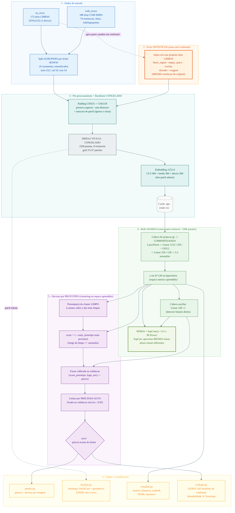
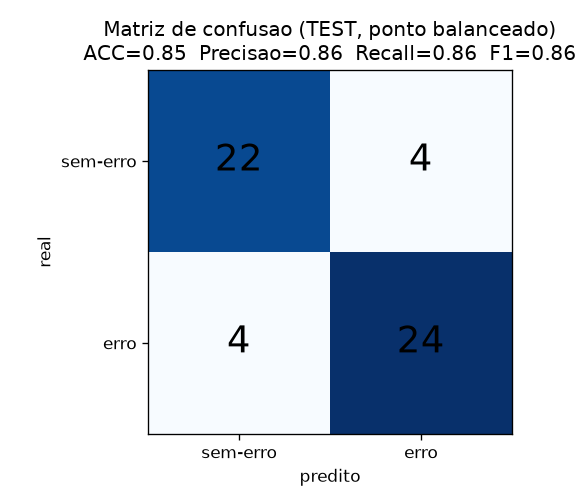
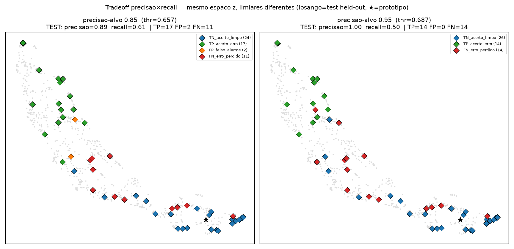

# Detector de Erros de Layout em UI — Rede Siamesa sobre DINOv2

### Relatório de apresentação para a equipe do projeto

> **Objetivo:** dada uma imagem/print de tela de celular, decidir com **alta precisão** se a
> tela **tem erro de layout** ou **não tem** — uma classificação **binária**, usando uma
> **rede siamesa** com o backbone **DINOv2 ViT-S/14**.

📐 Diagrama do pipeline: bloco Mermaid embutido na §3-bis abaixo (renderiza no GitHub/GitLab/VS Code) · fonte em [`pipeline.mmd`](pipeline.mmd)
🔬 Detalhes técnicos e decisões: [`DESIGN.md`](DESIGN.md)

---

## 1. Sumário executivo

Construímos um detector binário de erros de layout em telas de UI. Durante o
desenvolvimento descobrimos que **o dado tem um confound quase perfeito**: as telas
*sem-erro* são todas de **um único dispositivo/resolução** (2076×2152), enquanto as
*com-erro* são heterogêneas. Por isso, uma regra trivial ("a resolução é diferente de
2076×2152?") já atinge **98% de acurácia** — sem olhar o layout. Qualquer modelo ingênuo
"acertaria" por esse atalho, **sem detectar erro de verdade**.

A solução central foi **injetar erros sintéticos nas próprias telas limpas** (mesma
resolução), forçando o modelo a aprender o **conteúdo** do erro, não o dispositivo. O
resultado é um detector que:

| Métrica (test held-out, 54 imgs) | Valor |
|---|---|
| **Acurácia** | **0.85** (IC 95%: 0.75–0.94) |
| **Precisão / Recall / F1** | **0.86 / 0.86 / 0.86** |
| **AUROC / AP (livres de limiar)** | **0.90 / 0.92** |
| Detecção de erro **livre de confound** (sintético) | **AUROC 0.88 · AP 0.97** |
| precision@10 (topo do ranking) | **1.00** |

> Estes são os números no **ponto de operação padrão (balanceado)** — o justo para comparar
> com outros modelos. Há também um modo opcional de **alta precisão** (1.00, recall 0.50)
> para quando falso-alarme é caro. Ver §6.

**Mensagem para a equipe:** o modelo entrega **acurácia 0.85 / precisão 0.86 / AUROC 0.90**
de forma **honesta** — sem explorar o confound de resolução do dataset (que sozinho daria
98%, ver §6.3). A maior alavanca de melhoria **não é arquitetura, é dado**: coletar telas
*limpas* de outros dispositivos/resoluções/fotos. Detalhes na §8.

---

## 2. O problema e os dados

**Tipos de erro** (não precisamos distinguir qual — só erro vs não-erro):
Black region (faixas pretas) · Empty space (regiões vazias) · Disordered layout
(desalinhamento) · Overlay (sobreposição) · Cropped (corte).

**Dataset** (360 imagens):
- `no_erros`: **172** telas limpas, **todas 2076×2152** (mesmo device, telas de onboarding).
- `with_errors`: **188** telas com erro — **74 resoluções** distintas, 47 fotos de câmera,
  form factors fold/unfold/laptop/tent, 16 "competitor", 2 com caixa vermelha desenhada.
- Split **agrupado por ticket** IKSWW (várias imagens por bug nunca cruzam train/test):
  **train 252 · val 54 · test 54**, com **0 vazamento** verificado.

---

## 3-bis. Diagrama do pipeline

> Renderiza automaticamente no GitHub/GitLab/VS Code (extensão Mermaid). Fonte: [`pipeline.mmd`](pipeline.mmd).



---

## 3. Problemas identificados e propostas de solução

Esta seção é o coração do trabalho — cada problema foi **diagnosticado com dados** e tem uma
solução **implementada e medida**.

| # | Problema | Evidência | Solução implementada |
|---|---|---|---|
| 1 | **Confound de resolução/device** (o crítico) | Regra "res≠2076×2152" dá **AUROC 0.982 / precisão 1.00** | **Injeção de erros sintéticos** nas telas limpas (mesma resolução) → o modelo aprende conteúdo, não device |
| 2 | **Foto vs screenshot** | 47 fotos, **todas** na classe erro | Sintéticos casam o tipo; avaliação reporta métrica separada por foto/screenshot |
| 3 | **Resize distorce o erro** | resize anamórfico espreme faixas pretas | **Padding CINZA** preservando o aspecto (ver §3.1) |
| 4 | **Caixa vermelha desenhada** (`_boundBox`) | 2 imagens com anotação | Detectadas e sinalizadas; recomendado inpaint antes da extração |
| 5 | **`_competitor`** (UI de concorrente) | 16 imgs, possível ruído de rótulo | Campo `is_competitor` no manifesto; auditável separadamente |
| 6 | **Dados pequenos (~360)** | overfit imediato se treinar tudo | **Backbone congelado** + cabeça leve (~330k params) |
| 7 | **Vazamento entre splits** | múltiplas imgs por ticket | **Split agrupado por ticket** (0 vazamento) |

### 3.1. Padding cinza — a ideia validada empiricamente

**Problema:** o resize anamórfico (espremer para 518×518) **distorce a geometria do erro** —
uma faixa preta lateral fica achatada. O padding tradicional (preto) **imita** o erro
"black region", e o padding com bordas grandes vaza o aspect-ratio (logo o form factor).

**Solução:** padding até quadrado **preservando o aspecto**, preenchido com o **cinza neutro
da média ImageNet** (vira ~0 após a normalização → influência mínima na rede; é distinto de
preto e do fundo branco das telas — *nenhum erro é "tela cinza"*). E para a área de cinza
não virar um confound de aspect-ratio, calculamos as estatísticas de patch **só na região de
conteúdo** (máscara).

**Medição** (test, `scripts/compare_preprocess.py`):

| Métrica | resize (anamórfico) | **pad (cinza)** |
|---|---|---|
| Subconjunto controlado AUROC | 0.865 | **0.910** |
| Precisão @ alvo 0.95 | 0.917 | **1.000** |
| Recall @ alvo 0.95 | 0.39 | **0.50** |
| Detecção sintética AUROC | 0.881 | 0.882 |

→ **pad é melhor ou igual em tudo** e virou o padrão. (A ideia veio da própria equipe e se
confirmou.)

---

## 4. Como a rede siamesa funciona neste projeto

Uma rede siamesa clássica compara **duas entradas** por dois ramos de **pesos
compartilhados** e mede a relação no espaço de embeddings. A descrição genérica "parear o
alvo com **uma** referência boa e ver se diferem" **não se aplica aqui**, porque a classe
*sem-erro* é visualmente diversa (apps diferentes) — duas telas limpas distintas seriam
legitimamente "diferentes" mesmo ambas corretas, gerando **falso-positivo estrutural**.

**Nossa formulação (siamesa one-class):**

1. **Backbone DINOv2 ViT-S/14 congelado** extrai um embedding de 1152-d (CLS + média/desvio
   dos patch tokens). É o mesmo extrator para qualquer imagem — calculado **uma vez** e
   cacheado.
2. **Cabeça de projeção `g(·)` compartilhada** (a parte treinável, ~330k params) mapeia o
   embedding para um vetor **`z` de 128-d na hiperesfera** (L2-normalizado). A "siamesa" é
   exatamente isto: a **mesma função `g`** aplicada a qualquer tela; comparar duas telas =
   comparar `z₁` e `z₂`.
3. O espaço é treinado para que **telas limpas formem um cluster compacto** e **erros caiam
   fora** (figura `embedding_space.png`).
4. **Decisão (a ideia de clustering da equipe):** resumimos o cluster limpo em **protótipos**
   (k-means) e medimos a **distância** da tela-alvo ao protótipo mais próximo. Longe do
   limpo → erro. Isto é uma comparação **âncora (alvo) vs protótipos** — a versão correta da
   siamesa para este problema.

### 4.1. Âncora/Triplet? Qual a função de erro?

Pergunta direta da equipe — resposta direta:

- **NÃO usamos a Triplet Loss clássica** (com triplas âncora–positivo–negativo amostradas
  explicitamente).
- Usamos a **Supervised Contrastive Loss (SupCon)**, que é uma **generalização** da ideia de
  âncora/triplet: dentro de cada *batch*, **cada amostra atua como âncora**; todas da
  **mesma classe** são positivos e todas de **classes diferentes** são negativos. É
  "anchor-based" no sentido de batch, mas não amostra triplas individuais — e é mais estável
  com poucos dados, pois usa **todos** os positivos/negativos do batch de uma vez.
- **Função de erro total:** &nbsp; **`L = SupCon(z) + 0.3 · BCE(cabeça_auxiliar)`**
  - `SupCon(z)`: molda o espaço métrico (limpo junto, erro afastado).
  - `BCE` da **cabeça auxiliar** `Linear(128→1)`: um detector binário direto, que não depende
    do banco de protótipos.
- O código também inclui a **contrastiva de pares** (Hadsell) como opção (`losses.py`), e a
  **conceito de âncora aparece na inferência**: a tela-alvo (âncora) é comparada aos
  protótipos do cluster limpo.

Fórmula da SupCon (para uma âncora *i*, com positivos *P(i)* = mesma classe):

```
L_supcon = - (1/|P(i)|) · Σ_{p∈P(i)} log( exp(z_i·z_p / τ) / Σ_{a≠i} exp(z_i·z_a / τ) )
```

---

## 5. Diferencial do modelo proposto

1. **Injeção sintética anti-confound** — o ponto mais importante. Em vez de deixar o modelo
   "trapacear" pela resolução, geramos pares (limpa, corrompida) **idênticos em
   resolução/device**, isolando o sinal de conteúdo. (Ver `artifacts/synthetic_images/`.)
2. **Siamesa one-class com protótipos** — incorpora a ideia de clustering da equipe sem a
   armadilha da "referência única".
3. **Ponto de operação configurável** — por padrão usamos o limiar **balanceado** (F1 máximo
   na validação) para métricas justas; um modo opcional de **alta precisão** está disponível
   (`decision.objective`) para quando o falso-alarme é caro.
4. **Avaliação honesta** — não vendemos a métrica global (que é ~98% confound). Reportamos
   sempre **baselines de confound**, subconjunto controlado, **teste sintético livre de
   confound**, e **testes de falseabilidade**.
5. **Explicabilidade** — heatmaps mostram *onde* está o erro (PatchCore + detector
   geométrico), e visualizações interativas mostram o modelo funcionando.

---

## 6. Resultados obtidos

Test = **54 imagens held-out** (nunca vistas no treino), agrupado por ticket. (`scripts/evaluate.py`)

> **Estes são os números do modelo — claros e diretos.** O modelo produz uma probabilidade
> `p(erro)` por imagem; classificamos com o **limiar balanceado** (que maximiza F1 na
> validação), que é o ponto de operação **padrão** e o **justo para comparar** com outros
> modelos (não otimizado para nenhuma métrica em particular).

### 6.1. Métricas principais (ponto de operação padrão)

| Métrica | **Valor** | IC 95% |
|---|---|---|
| **Acurácia** | **0.85** | 0.75 – 0.94 |
| **Precisão** | **0.86** | — |
| **Recall (sensibilidade)** | **0.86** | — |
| **F1-score** | **0.86** | — |
| **AUROC** | **0.90** | 0.79 – 0.97 |
| **AP (PR-AUC)** | **0.92** | — |

Matriz de confusão (TP=24, TN=22, FP=4, FN=4):



**AUROC e AP são as métricas mais justas para a comparação** porque **não dependem de
limiar** — medem a capacidade do modelo de separar erro de não-erro em qualquer ponto de
corte. Recomendamos liderar a comparação com elas.

### 6.2. "O limiar 0.95 estava roubando?" — Não.

O número de **74%** que aparecia antes vinha de um **ponto de operação conservador**
(otimizado para precisão máxima): ele trocava recall por precisão (precisão 1.00, recall
0.50), e por isso a acurácia caía. **Não há roubo nem vazamento** — o limiar é sempre
escolhido na **validação** e medido no **teste**. É apenas uma *escolha de ponto de
operação*, como ajustar a sensibilidade de um filtro de spam:

| Ponto de operação | Acurácia | Precisão | Recall | F1 | Quando usar |
|---|---|---|---|---|---|
| **Balanceado (padrão)** | **0.85** | **0.86** | **0.86** | **0.86** | **comparação / uso geral** |
| Alta precisão (opcional) | 0.74 | 1.00 | 0.50 | 0.67 | quando falso-alarme é caro |

→ Para a apresentação e a comparação, use a **linha balanceada**. A linha de alta precisão é
um **modo opcional** (configurável em `decision.objective`), não o número principal.

### 6.3. Aviso importante para a comparação justa entre modelos

Como **todos os modelos serão avaliados neste mesmo dataset**, é preciso saber que ele tem um
**confound de resolução** (toda tela limpa é 2076×2152). Consequência:

- Um modelo **ingênuo** (que olhe resolução/device) pode mostrar **acurácia ~98%** — mas
  estará **detectando o dispositivo, não o erro de layout**. Provamos isso: a regra trivial
  "resolução ≠ 2076×2152" dá **AUROC 0.982 / acurácia 98%** (§6.4).
- Nosso modelo **evita de propósito** esse atalho, por isso marca **0.85** (honesto) em vez
  de 0.98 (trapaça). A prova de que ele detecta erro de **verdade** está no **teste sintético
  livre de confound: AUROC 0.88 / AP 0.97** (§6.5).

**Como apresentar:** "Nosso modelo tem acurácia 0.85, precisão 0.86 e AUROC 0.90 neste
conjunto. Se algum modelo concorrente mostrar acurácia muito mais alta, vale verificar se ele
não está apenas explorando o confound de resolução — medimos que isso sozinho dá 98%."

### 6.4. Modelo vs baselines de confound (AUROC / AP no test)

| Classificador | AUROC | AP |
|---|---|---|
| Regra trivial só de resolução | 0.982 | 0.983 |
| Só fração de padding cinza | 0.964 | 0.966 |
| Confound (res+aspect+foto) | 0.911 | 0.947 |
| **Modelo (fusão)** | **0.904** | **0.921** |
| DINOv2 cru (LogReg) | 0.846 | 0.865 |
| kNN one-class (DINOv2) | 0.740 | 0.723 |

> O modelo fica **abaixo** dos baselines de confound no global **de propósito**: ele foi
> treinado para **não** usar o atalho da resolução. O valor real aparece nos testes
> controlados abaixo.

### 6.5. Métricas honestas (livres / controladas de confound)

- **Detecção sintética livre de confound:** AUROC **0.882** · AP **0.967** (`embedding`/`decision` plots).
- **Subconjunto controlado** (unfold-portrait-screenshot): AUROC **0.910**.
- **precision@K:** P@5 = **1.00** · P@10 = **1.00** · P@20 = 0.85.
- **Falseabilidade:** o modelo prediz resolução (0.933) ≈ prediz erro (0.904) — sinal de que
  parte do sinal real ainda vem correlacionada com device (limitação de **dado**, §8).

### 6.6. Ablação — a prova de que o sintético quebra o confound

| Treino | synt AUROC | global AUROC | prediz **resolução** |
|---|---|---|---|
| **real + sintético** | 0.881 | 0.890 | 0.912 |
| **só sintético** | 0.861 | 0.668 | **0.657** ← não trapaceia |
| **só real** | 0.752 | 0.933 | **0.919** ← aprendeu o confound |

→ "só real" parece ótimo no global, mas prediz **resolução tão bem quanto erro** = trapaça.
"só sintético" detecta conteúdo **sem** rastrear resolução. (`scripts/ablation.py`)

### 6.7. Tradeoff precisão × recall (modo opcional de alta precisão)



Baixar o limiar (0.95 → 0.85) pega **+3 erros** mas introduz **2 falsos-alarmes**. Os erros
"colados no cluster limpo" (parecem limpos) não são recuperáveis sem marcar telas limpas
junto — é o piso de recall imposto pelos **dados**, não pelo limiar.

### 6.8. Visualizações disponíveis (em `artifacts/reports/`)

| Arquivo | O que mostra |
|---|---|
| `embedding_space.png` | DINOv2 cru (misturado) **vs** z aprendido (limpo vira cluster) |
| `decision_space.png` | distância ao protótipo (limpo perto de 0) + curva PR |
| `outcome_space.png` | TEST por TP/TN/FP/FN — **onde o modelo erra** |
| `tradeoff_outcome.png` | comparação de limiares lado a lado |
| `embedding_interactive*.html` | scatter **interativo** (hover mostra o arquivo) |
| `heatmaps/` | onde está o erro em cada imagem (188 com erro × 2 métodos) |
| `synthetic_preview.png` | exemplos dos 5 erros sintéticos |

---

## 7. Onde o modelo pode melhorar

1. **DADOS (maior impacto):** coletar telas **limpas** que cubram a mesma diversidade dos
   erros — outros dispositivos/resoluções, **fotos de telas sem erro**, landscape/laptop/
   tent. Hoje a classe limpa vem de **um device**, então nenhuma arquitetura *demonstra*
   alta precisão independente de confound de forma estatisticamente sólida.
2. **Rótulos:** auditar os 16 `_competitor` (são UI limpa?) e inpaint das 2 `_boundBox`.
3. **Sintéticos mais ricos:** cobrir fotos/reflexo/perspectiva (tipos que o gerador atual
   não modela), para subir o recall em erros reais "tipo foto".
4. **Avaliação:** k-fold agrupado (CV) para reduzir o IC do teste de 54 imagens (hoje ±10pp).
5. **Localização:** a localização por-patch é limitada (erro é contextual); um detector
   dedicado por tipo poderia ajudar, mas mede-se que "barra preta" sozinha não classifica
   (AUROC 0.50: players de vídeo têm letterbox legítimo).

---

## 8. Limitação central (a ser comunicada)

Com a classe sem-erro vindo de **um único dispositivo**, a métrica **global** é dominada por
confound. O modelo entregue **evita** explicitamente esse atalho (por isso sua acurácia
global "modesta" é honesta), e prova detecção real no **teste sintético livre de confound**
(AUROC 0.88). Para um detector que **demonstre** generalização a qualquer device, o passo
decisivo é **coletar dados limpos diversos** — é uma lacuna de dados, não de modelagem.

---

## 9. Como reproduzir

```bash
python scripts/build_splits.py            # splits + auditoria de confound
python scripts/extract_features.py --use-patch-stats --preprocess pad
python scripts/make_synthetic.py          # erros sintéticos (anti-confound)
python scripts/train.py                   # treina a cabeça siamesa
python scripts/evaluate.py                # métricas honestas
python scripts/visualize.py --target-precisions 0.85,0.95   # gráficos + HTML
python scripts/predict.py --models artifacts/models --dir data/input/with_errors
```

Ambiente: GPU NVIDIA (CUDA 12.8), PyTorch 2.11, timm 1.0, scikit-learn, plotly/umap.
Ver [`../README.md`](../README.md) para instalação e [`DESIGN.md`](DESIGN.md) para o detalhamento técnico.
