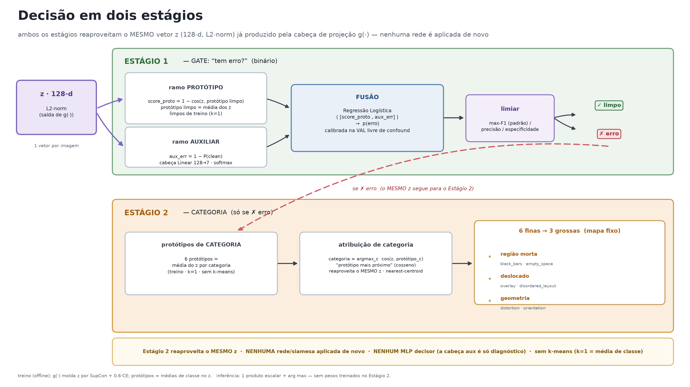
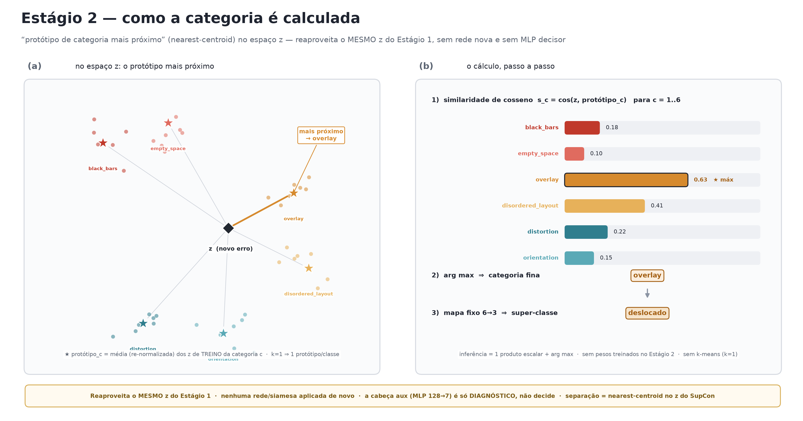
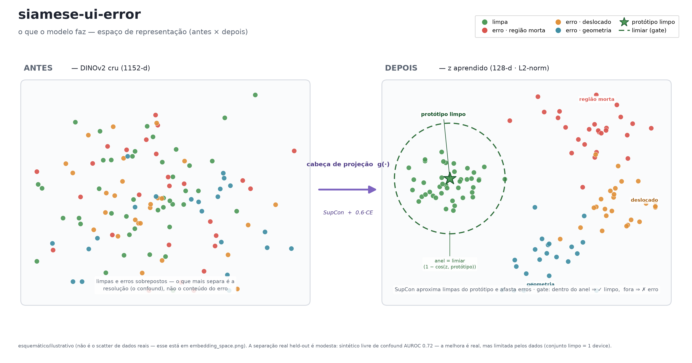

# Decisão em dois estágios — relatório técnico (com foco no **Estágio 2**)

> Documento de apoio à apresentação. Responde às perguntas levantadas pela equipe sobre o
> bloco **`6 · Two-stage decision`** do `docs/pipeline_v2.mmd`:
> *“Como funciona realmente o Stage 2? Usa os embeddings já gerados? Aplica uma rede siamesa
> de novo? Aplica algum MLP? Como é calculada a separação dos grupos de erro — qual modelo?”*
>
> Todas as afirmações abaixo estão ancoradas no código real (`arquivo:linha`).

---

## TL;DR — respostas diretas

| Pergunta | Resposta curta |
|---|---|
| **O Estágio 2 usa os embeddings já gerados?** | **Sim.** Exatamente o mesmo vetor `z` (128-d, L2-norm) já produzido pela cabeça de projeção `g(·)`. Não há nova extração de features. |
| **Aplica uma rede siamesa de novo?** | **Não.** `g(·)` roda **uma única vez** (na geração dos embeddings). O Estágio 2 não executa nenhuma rede. |
| **Aplica algum MLP (como decisor)?** | **Não.** O decisor canônico é o **protótipo de categoria mais próximo**. Existe uma cabeça auxiliar `Linear(128→7)`, mas ela é **só diagnóstico/ablação — não decide** (`config.py:105`, `evaluate.py:500,548`). |
| **Como é calculada a separação dos grupos? Qual modelo?** | Um classificador de **protótipo mais próximo (nearest-centroid)** por **cosseno** no espaço `z`. O “modelo” que **torna** os grupos separáveis é a cabeça `g(·)` treinada com **SupCon multi-classe + CE** — isso acontece no **treino**. Na **decisão** não há modelo treinado nem clustering ao vivo: é `argmax_c cos(z, protótipo_c)`. |

---

## 1. O que é `z` e de onde vem (contexto)

`z` é a saída da cabeça de projeção siamesa `g(·)`, aplicada **uma vez** sobre as features do
DINOv2 congelado:

```
imagem ─► DINOv2 ViT-S/14 (CONGELADO) ─► CLS + média/desvio dos patches (1152-d)
       ─► g(·):  LayerNorm → Linear(1152→256) → GELU → Dropout(0.3) → Linear(256→128) → L2-norm
       ─► z ∈ ℝ¹²⁸  (vetor unitário)
```

- `g(·)` = `ProjectionHead` (`model.py:23-40`); a cabeça auxiliar = `self.aux = nn.Linear(128, 7)` (`model.py:79`).
- `z` é **calculado uma vez** por imagem (`evaluate.py:164-166`, função `model_embeddings` → `model.py:84`).
  **Os dois estágios consomem esse mesmo `z`.**

A figura abaixo mostra o fluxo completo da decisão (Estágio 1 + Estágio 2) — note que o **mesmo `z`**
alimenta os dois:



---

## 2. Estágio 1 — gate “tem erro?” (resumo, para contexto)

O gate funde **dois sinais** derivados de `z` e calibra um limiar:

1. **score do protótipo limpo** — `score_proto = 1 − cos(z, protótipo-limpo-mais-próximo)`
   (`decision.py:26-30`). O protótipo limpo = média dos `z` **limpos de treino** (`evaluate.py:172`, `k=1`).
2. **cabeça auxiliar** — `aux_err = 1 − P(clean)` do softmax de 7 classes (`evaluate.py:46-50`, modo multiclass).
3. **fusão** = **Regressão Logística de 2 features** `LogisticRegression().fit([score_proto, aux_err], y)`
   (`evaluate.py:210-214`), treinada no **conjunto livre de confound** (limpas-val=0 + `val_synth` erros=1 +
   `val_reflow` limpas=0; `evaluate.py:196-205`).
4. **limiar** escolhido **no mesmo conjunto de calibração** (max-F1 por padrão; `evaluate.py:373-380`).

> ⚠️ Único ponto onde algo é “treinado na decisão”: a **LogReg de fusão + o limiar** (Estágio 1).
> Isso é calibração na **val**, nunca no teste (`evaluate.py:176`). O Estágio 2 **não treina nada**.

---

## 3. Estágio 2 — categoria do erro (o foco)

### 3.1 Reaproveita o mesmo `z` (sem rede nova)

O Estágio 2 recebe o **mesmo `z`** já calculado e só faz **álgebra linear** — não há `model(...)`,
não há novo forward, não há nova extração de features (`evaluate.py:538-546`; a atribuição é
`assign_category(z, ...)` em `decision.py:66-70`, que só faz `normalize`, produto escalar e `argmax`).

### 3.2 Como os protótipos de categoria são construídos (offline, no treino)

`fit_category_prototypes(z_train[erros], cat_ids, k=1)` (`decision.py:46-63`, chamado em
`evaluate.py:509-510`): para **cada** categoria de erro, calcula **um protótipo**:

> **protótipo_c = média dos `z` (já L2-normalizados) das imagens de TREINO da categoria `c`,
> e o resultado é re-normalizado para norma 1** (`decision.py:38,40-41`).

- Com o padrão **`k_prototypes = 1`** (`config.py:90`) ⇒ **1 protótipo por classe = a média da classe** (centroide).
- `k-means` **só** é usado quando `k>1` **e** a categoria tem amostras suficientes; classes raras caem para
  a média mesmo com `k>1` (`decision.py:39,60`). No padrão, **não há k-means**.

### 3.3 Como a categoria é atribuída (inferência) — “protótipo mais próximo”

`assign_category(z, protos, proto_cat)` (`decision.py:66-70`):

```python
zc   = normalize(z)            # z já é unitário; normaliza por segurança
sims = zc @ protos.T          # cosseno de z contra cada protótipo de categoria
return proto_cat[sims.argmax(axis=1)]   # categoria do protótipo MAIS PRÓXIMO
```

Ou seja: **`categoria = argmax_c cos(z, protótipo_c)`** — um classificador de **centroide mais próximo
(nearest-centroid)**. A figura abaixo mostra o mecanismo passo a passo:



A inferência do Estágio 2 é, literalmente, **1 produto escalar + `argmax`** — sem pesos treinados,
sem iteração, sem clustering ao vivo.

### 3.4 De onde vem a separabilidade — “qual modelo separa os grupos?”

O que **torna** os erros separáveis **não** é nenhum modelo aplicado na decisão — é a **cabeça de
projeção `g(·)` treinada** (`train.py:207-218`) com:

```
perda = SupCon(z)  +  0.6 · CE(cabeça auxiliar, 7 classes)
```

- **SupCon multi-classe** (supervisionada, `losses.py`) aproxima `z` de **mesma categoria** e afasta `z` de
  categorias diferentes — é isso que “esculpe” os clusters por tipo de erro.
- Na decisão, os clusters são resumidos por **protótipos = médias de classe** e a atribuição é por cosseno.

Intuição visual (esquemática) do efeito do treino — limpas colapsam num cluster e os erros se afastam,
agrupando-se nas **3 super-classes** do Estágio 2:



> **Resumo do “qual modelo”:** o modelo é a **cabeça siamesa `g(·)` + SupCon** (treino). A *decisão* de
> categoria é um **classificador por protótipo/centroide** (sem parâmetros treinados além dos protótipos,
> que são médias de classe). **Não** é uma segunda rede, **não** é um MLP, **não** é k-means.

### 3.5 Taxonomia: 6 finas → 3 grossas (mapa fixo)

A métrica **primária** do Estágio 2 é a **taxonomia grossa (3 super-classes)** — `evaluate.py:550-552`.
O mapa é fixo (`manifest.py:57-64`):

| Super-classe (grossa) | Categorias finas |
|---|---|
| **dead_region** (região morta) | `black_bars`, `empty_space` |
| **displaced_content** (deslocado) | `overlay`, `disordered_layout` |
| **geometry** (geometria) | `distortion`, `orientation` |

A taxonomia **fina (6 classes)** é **secundária/exploratória** (teto estrutural de separabilidade
~F1 0.2 nas features; `manifest.py:49-52`).

---

## 4. O que **é** e o que **não é** (desfazendo confusões)

| ❌ NÃO é | ✅ É |
|---|---|
| uma segunda rede siamesa aplicada de novo | o **mesmo `z`** reaproveitado |
| um MLP treinado para categoria | **nearest-centroid** por cosseno (`argmax_c cos(z, protótipo_c)`) |
| k-means / clustering **não-supervisionado** | **médias de classe supervisionadas** (k=1 no padrão) |
| nova extração de features (DINOv2 de novo) | **álgebra linear** sobre `z` já calculado |
| a cabeça auxiliar (softmax) como decisor | a cabeça aux é **só diagnóstico/ablação** |

---

## 5. Caveats honestos (incluir ao apresentar)

Estes pontos evitam super-venda e perguntas difíceis sem resposta:

1. **Headline é o ORÁCULO; produção é condicional ao gate.** O F1-macro primário categoriza **todos**
   os erros (`evaluate.py:561`); o caminho de produção (`condicional_ao_gate`, `evaluate.py:560-562`) só
   categoriza erros que o **Estágio 1 já pegou**. A recall ponta-a-ponta honesta é
   **`recall_gate × recall_estágio2`**, não o número do oráculo. Reporte os dois e lidere com o condicional.
2. **Em modo DEV, o “held-out” é a própria val (in-sample).** Só os números de **`--final-test`** são
   vinculantes (`evaluate.py:148-157`). Diga em qual modo cada número foi gerado.
3. **Sempre cite o IC95.** Suportes minúsculos (`orientation` ~7, `distortion` ~13) + F1-macro ⇒ IC
   (bootstrap por ticket) **largo**; um único ticket erra e o número balança (`evaluate.py:519-521`).
   **Nunca** cite o ponto sem o IC.
4. **F1 grosso é tarefa mais fácil, não “melhor discriminação”.** O 6→3 agrega vizinhos confundíveis e
   **infla** o F1 mecanicamente vs. a tarefa fina. Apresente o ganho como **agregação de tarefa**.
5. **A super-classe `geometry` é fina e contaminada por confound.** `distortion` e `orientation` **não
   têm gerador sintético** (`synthetic.py:37`) ⇒ zero positivos livres de confound; seus protótipos vêm de
   poucos erros reais (confound-laden). Trate seus números como **baixa confiança**.
6. **O protótipo é a decisão de registro; a cabeça aux NÃO.** Não apresente o `argmax` da aux como “a
   predição do modelo” — protótipo e aux podem **discordar** (`evaluate.py:548,554-555`).
7. **`k=1` colapsa cada categoria a uma média.** Uma categoria multimodal (ex.: estilos distintos de
   `overlay`) vira **um** centroide possivelmente entre os modos (`decision.py:39-41`).
8. **Rótulo único para erros que coocorrem.** Telas reais às vezes têm vários erros, mas cada uma recebe
   **uma** categoria (`manifest.py:51-52`) — parte das “confusões” fora da diagonal é **arbitrariedade de
   rótulo**, não erro do modelo. Não sobre-interprete a matriz de confusão.

> **Anti-vazamento (a favor):** protótipos limpos e de categoria são ajustados **só no treino**
> (`evaluate.py:172,509-510`); fusão + limiar calibrados **só na val**; teste trancado por `protocol.py`
> (`--final-test`).

---

## 6. Mapa do código (fontes da verdade)

| Componente | Onde |
|---|---|
| Cabeça `g(·)` + aux | `src/siamese/model.py:23-40` (ProjectionHead), `:79` (aux Linear 128→7) |
| Protótipo limpo (Estágio 1) | `src/siamese/evaluate.py:172`; score em `decision.py:26-30` |
| Fusão LogReg + limiar (Estágio 1) | `src/siamese/evaluate.py:210-214` (fusão), `:373-380` (limiar) |
| **Protótipos de categoria** | `src/siamese/decision.py:46-63`; chamada em `evaluate.py:509-510` |
| **Atribuição por cosseno (`argmax`)** | `src/siamese/decision.py:66-70` |
| Método canônico = `prototype` | `src/siamese/config.py:105`; uso em `evaluate.py:512,548` |
| Avaliação Estágio 2 (oráculo/condicional/grossa/fina) | `src/siamese/evaluate.py:497-582` |
| Mapa fino→grosso | `src/siamese/manifest.py:57-64` |
| Treino (SupCon + CE) | `src/siamese/train.py:207-218` |

---

## 7. Figuras (geradas, reproduzíveis)

| Arquivo | Mostra | Script |
|---|---|---|
| `artifacts/reports/decisao_two_stage.png` · `.pdf` | fluxo completo dos 2 estágios (com a matemática real) | `scripts/draw_two_stage_decision.py` |
| `artifacts/reports/estagio2_prototipo.png` · `.pdf` | mecanismo nearest-prototype do Estágio 2 (geometria + placar de cossenos) | `scripts/draw_stage2_mechanism.py` |
| `artifacts/reports/espaco_representacao.png` · `.pdf` | intuição antes×depois do espaço `z` (separabilidade vem do treino) | `scripts/draw_embedding_concept.py` |
